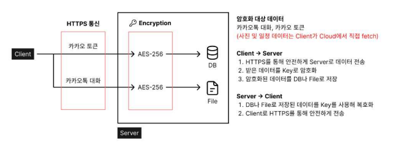

# 몽글몽글

카카오톡 텍스트 분석을 통한 자동 감정 기록 서비스
(현재는 서비스 중단)

[플레이스토어](https://play.google.com/store/apps/details?id=com.rtsoju.mongle)

[프로젝트 소개 ppt](https://docs.google.com/presentation/d/1iWaR5IdjX7xWEVJXK_EBlllMSnWPxvWV/edit?usp=share_link&ouid=109824386331812978343&rtpof=true&sd=true)

## 아키텍처
 - 전반적인 앱 구조는 [Google에서 제안하는 Clean Architecture](https://developer.android.com/topic/architecture?hl=ko#recommended-app-arch)를 따릅니다.
 - Data, Domain, Presentation으로 나누어 앱을 구성합니다.
    - Data: DataSource(API, Internal Storage), Repository, Data Model를 포함하
    는 모듈
    - Domain: Usecase(Business Logic), Domain Model, Common Repository를 
    포함하는 모듈
    - Presentation: View, ViewModel를 포함하는 모듈

앱은 기본적으로 Google의 Recommended Architecture를 따르지만, 앱의 특성에 맞게 약간 변형해서 사용하고 있습니다. 
 - Model의 경우 같은 계열의 Model을 Data, Domain, View이 각각 가지고 있습니다. 이는 각 모듈간 의존성을 최소화하기 위한 조치입니다. 그래서 각 모듈에서 사용하는 Model들 간에 변환을 대신 해줄 Mapper가 필요합니다. 
 - Repository의 경우 Interface를 Domain으로 빼고, 실제 Implementation을 Data
에 두어 DI(use hilt)를 사용해서 주입해주는 방식으로 구현했습니다. 향후 Repository를 교체할 때 유용하며, 모듈간 의존성을 최소화할 수 있다.

## 사용자 데이터 암호화 방안

사용자의 대화 데이터는 개인정보가 포함되어있을 수 있으므로 암호화가 필요합니다.

1. 데이터를 서버와 주고받을 때 HTTPS로 외부 패킷 유출 방지
2. 감정 분석된 후에는, 저희 팀을 포함해서 여러분을 제외한 그 누구도 읽을 수 없도록 AES256으로 암호화되어 데이터베이스에 저장
3. 데이터베이스는 AWS RDS 리소스 암호화 시스템에 의해 한번 더 암호화됩니다.